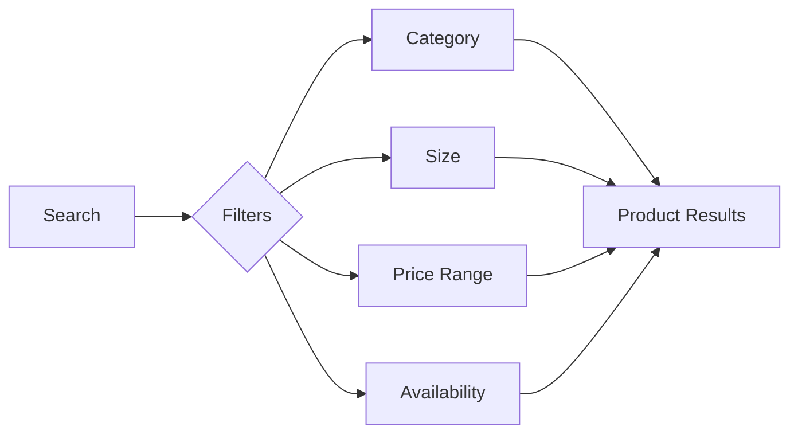
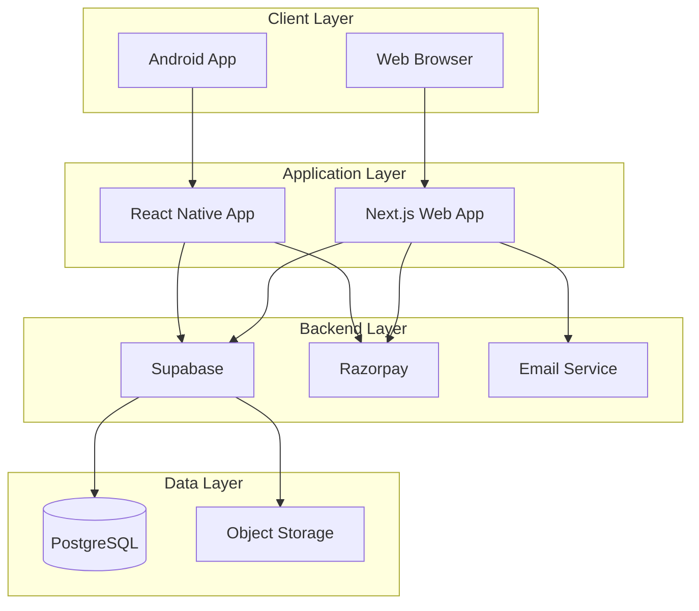

<div align="center">


<h1>Aura & Silk</h1>
<h3>Premium Full-Stack E-Commerce Platform</h3>

[](https://nextjs.org/)
[](https://react.dev/)
[](https://reactnative.dev/)
[](https://expo.dev/)
[](https://www.typescriptlang.org/)
[](https://supabase.com/)

<p>
  <a href="#-overview">Overview</a> •
  <a href="#-platforms">Platforms</a> •
  <a href="#-features">Features</a> •
  <a href="#%EF%B8%8F-tech-stack">Tech Stack</a> •
  <a href="#%EF%B8%8F-developer">Developer</a>
</p>

</div>

<br/>

## 📋 Overview

**Aura & Silk** is a sophisticated full-stack e-commerce platform designed for ethnic fashion retail. Built with modern technologies, it delivers a seamless shopping experience across web and mobile platforms with real-time synchronization, secure payments, and intelligent notifications.

> [!IMPORTANT]
> This is a **private project**. Source code is not publicly available. This repository serves as a deployment and release hub.

<br/>

## 🌐 Platforms

### 🖥️ Web Application

**🌍 Live:** [https://silk-aura.vercel.app](https://silk-aura.vercel.app)

**Capabilities:**
- 🚀 Server-Side Rendering
- 📱 Responsive Design
- ⚡ Progressive Web App
- 🔄 Real-time Updates
- 🎨 Modern UI/UX

**Optimized for:** Desktop • Tablet • Mobile Browsers

---

### 📱 Android Application

**📦 Download:** [Latest APK from Releases](../../releases)

**Capabilities:**
- ⚡ Native Performance
- 💾 Offline Cart Storage
- 🔔 Push Notifications
- 📳 Haptic Feedback
- 🔗 Deep Linking

**Requirements:** Android 5.0+ • 50MB Storage

<br/>

## ✨ Features

<details open>
<summary><b>🛍️ Customer Experience</b></summary>

<br/>

### Product Discovery



- **Advanced Search Engine** - Fast, intelligent product discovery
- **Smart Filtering** - Category, size, price, and availability filters
- **Dynamic Catalog** - Real-time inventory updates
- **High-Quality Imagery** - Multiple product images with zoom
- **Detailed Information** - Size charts, descriptions, and specifications

### Shopping Experience

| Feature | Description |
|---------|-------------|
| 🛒 **Smart Cart** | Cross-device synchronization with persistent storage |
| 💳 **Flexible Payments** | Cash on Delivery + Razorpay online payments |
| 🔒 **Secure Checkout** | Encrypted payment processing with verification |
| 📦 **Order Tracking** | Real-time status updates and notifications |
| 👤 **Guest Checkout** | Shop without mandatory registration |

### Account Management

**🔐 Authentication**
- Secure login with email verification
- Password reset functionality
- Session management
- Two-factor authentication ready

**👤 Profile Management**
- Avatar upload and customization
- Personal information updates
- Security settings control
- Account deletion option

**📦 Order Management**
- Complete order history
- Real-time status tracking
- Quick reorder functionality
- Invoice download

**📍 Address Book**
- Multiple delivery addresses
- Default address selection
- Easy address editing
- Delivery tracking integration

### Mobile-Exclusive Features

> **💡 TIP:** The Android app provides enhanced features for on-the-go shopping

- **Native Performance** - Smooth 60 FPS animations
- **Offline Capability** - Cart persists without internet
- **Push Notifications** - Order updates and promotional alerts
- **Haptic Feedback** - Tactile responses for actions
- **Deep Linking** - Direct navigation to products

</details>

<details>
<summary><b>⚙️ Administrative Dashboard</b></summary>

<br/>

### Business Intelligence

```
📊 Analytics Dashboard
├── 💰 Revenue Tracking
├── 📈 Sales Trends
├── 📦 Order Volume
├── 👥 Customer Insights
└── 📉 Product Performance
```

### Management Modules

#### 📦 Product Management
- ✅ Complete CRUD operations
- ✅ Multi-image upload system
- ✅ Size-specific inventory
- ✅ Category organization
- ✅ Discount management
- ✅ Bulk operations

#### 🛍️ Order Management
- ✅ Real-time order dashboard
- ✅ Status update system
- ✅ Automatic notifications
- ✅ Payment verification
- ✅ Customer details view
- ✅ Filtering and search

#### 📊 Inventory Control
- ✅ Automatic stock reduction
- ✅ Size availability tracking
- ✅ Low stock alerts
- ✅ Inventory reports

#### 👥 Customer Management
- ✅ User account overview
- ✅ Order history per customer
- ✅ Communication tools
- ✅ Account management

### System Administration

> **📝 NOTE:** Advanced features for platform management

- **App Release Management** - Version control with automatic user notifications
- **Push Notification System** - Targeted customer engagement campaigns
- **Webhook Integrations** - Real-time event processing and automation
- **Security Controls** - Role-based access and audit logs

</details>

<br/>

## 🏗️ Tech Stack

### 🌐 Web Application

#### Frontend

```typescript
// Framework & UI
Next.js 16          // App Router, SSR, API Routes
React 19            // Component Library
TypeScript 5        // Type Safety

// Styling & Animation
Tailwind CSS 4      // Utility-First CSS
Framer Motion       // Smooth Animations
Lucide React        // Icon System

// Utilities
clsx                // Conditional Classes
tailwind-merge      // Class Merging
```

#### Backend & Services

```typescript
// API & Database
Next.js API Routes  // RESTful Endpoints
Supabase            // PostgreSQL + Auth
@supabase/ssr       // Server-Side Auth

// Integrations
Razorpay            // Payment Gateway
Expo Server SDK     // Push Notifications
Nodemailer          // Email Service

// Charts & Visualization
Recharts            // Analytics Graphs
```

---

### 📱 Mobile Application

#### Core Framework

```typescript
// Platform
Expo 54             // Development Framework
React Native 0.81   // Native Runtime
Expo Router 6       // File-based Navigation
TypeScript 5        // Type Safety

// UI & Styling
NativeWind          // Tailwind for React Native
Tailwind CSS 4      // Design System
React Native        // Native Components
Reanimated 4      // Performant Animations
Gesture Handler   // Touch Interactions
```

#### Features & Integration

```typescript
// State Management
Zustand             // Global State
AsyncStorage        // Local Persistence

// Backend
Supabase JS         // API Client
React Hooks         // Component State

// Native Capabilities
Expo Notifications  // Push Messages
Expo Image Picker   // Media Upload
Expo Haptics        // Tactile Feedback
Expo Device         // Device Info
RN WebView          // Payment UI
```

### 🗄️ Backend Infrastructure

| Component | Technology | Purpose |
|-----------|-----------|---------|
| **Database** | Supabase PostgreSQL | Primary data storage with Row Level Security |
| **Authentication** | Supabase Auth | JWT-based user authentication & sessions |
| **File Storage** | Supabase Storage | Product images with CDN delivery |
| **Real-time** | Supabase Subscriptions | Live data synchronization |
| **Webhooks** | Custom Edge Functions | Event-driven automation |
| **Email** | Nodemailer | Transactional emails |
| **Payments** | Razorpay | Secure payment processing |

<br/>

## 🔒 Security & Performance

<table>
<tr>
<td width="50%" valign="top">

### Security Measures

```
🛡️ Application Security
├── Row Level Security (RLS)
├── JWT Authentication
├── HTTPS Encryption
├── Password Hashing (bcrypt)
├── CSRF Protection
├── Input Validation
├── SQL Injection Prevention
└── XSS Protection

🔐 Payment Security
├── PCI DSS Compliance
├── Razorpay Secure Gateway
├── Payment Verification
└── Transaction Encryption
```

</td>
<td width="50%" valign="top">

### Performance Optimizations

```
⚡ Web Performance
├── Server-Side Rendering
├── Static Site Generation
├── Image Optimization
├── Code Splitting
├── Lazy Loading
├── CDN Delivery
└── Caching Strategy

📱 Mobile Performance
├── Native Compilation
├── 60 FPS Animations
├── Optimized Bundle Size
├── Efficient State Updates
└── Memory Management
```

</td>
</tr>
</table>

<br/>

## 🎨 Design System

> **Premium Aesthetic • Intuitive Navigation • Seamless Experience**

### 🎭 Visual Design
- Modern aesthetics
- Consistent branding
- Attention to detail
- Premium feel

### ⚡ Performance
- Fast load times
- Smooth transitions
- Optimized assets
- Efficient rendering

### ♿ Accessibility
- Semantic HTML
- ARIA labels
- Keyboard navigation
- Screen reader support

### 📱 Responsive Design
- Mobile-first approach
- Adaptive layouts
- Touch-optimized interactions
- Cross-platform compatibility

<br/>

## 🚀 Infrastructure



<div style="user-select: none;">

### 🌐 Web Hosting

```
☁️  Cloud Infrastructure
🚀  Automatic Deployments  
🌍  CDN Distribution
🔒  SSL Certificates
✅  99.9% Uptime SLA
```

### 📱 Mobile Distribution

```
📦  GitHub Releases
🔄  Version Management
🔔  Update Notifications
📊  Crash Analytics
💬  User Feedback System
```

### 🗄️ Backend Services

```
☁️  Supabase Cloud Platform
📈  Auto Scaling
💾  Automated Backups
🔍  Monitoring & Alerts
⚡  High Availability
```

</div>

<br/>

## 👨‍💻 Developer

<div align="center">


### **Neel Sapariya**

**Full-Stack Developer • Solo Project**

**Built entirely by one developer - from concept to deployment**

</div>

This complete e-commerce platform was single-handedly designed, developed, and deployed by **Neel Sapariya**, encompassing every aspect of modern software development.


<div align="center">

<br/>

[](https://github.com/sapariyaneel)
[](https://linkedin.com/in/neelsapariya)

</div>

<br/>

## 📄 License

**Private & Proprietary Project**

All rights reserved. The source code is not available for public use, modification, or distribution.

For business inquiries or collaboration opportunities, please reach out via the links above.

<br/>

---

<div align="center">

**Built with Precision, Passion, and Modern Technology**
<br/>
<br/>
[](../../releases)
[](#)
[](#)
</div>
